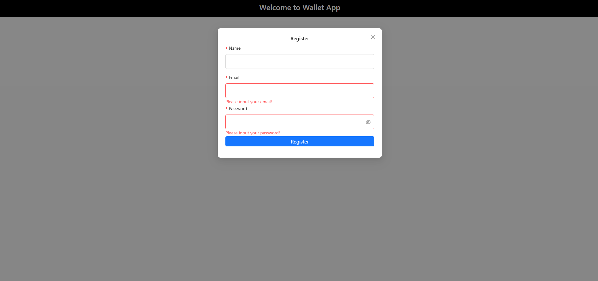

# Taskforce-wallet-web-app
Code of Africa Challenge "A MERN stack Wallet Web Application to track transactions, manage budgets, and visualize expenses"

## Table of Contents
- [Features](#features)
- [Demo](#demo)
- [Screenshots](#screenshots)
- [Installation](#installation)
- [Usage](#usage)
- [Technologies Used](#technologies-used)
- [Contributing](#contributing)

## Features
- Add Accounts
- Track income and expenses
- Generate detailed financial reports
- Manage categories 
- Visualize data with charts
- Export Excel File

## Demo
[Live Demo](https://taskforce-wallet-web-app-lswk.vercel.app/)

## Screenshots

