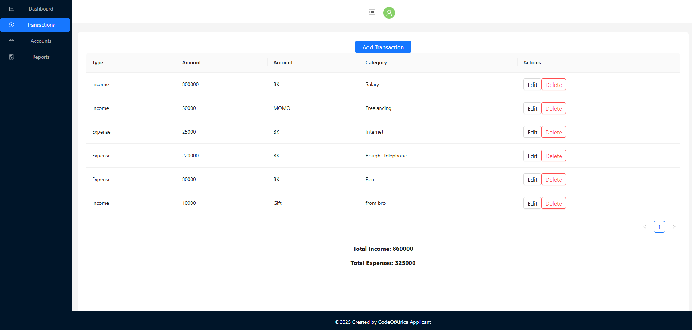

# Taskforce-wallet-web-app

Code of Africa Challenge "A MERN stack Wallet Web Application to track transactions, manage budgets, and visualize expenses"

## Table of Contents

- [Features](#features)
- [Demo](#demo)
- [Installation](#installation)
- [Technologies Used](#technologies-used)
- [Usage](#usage)
- [Screenshots](#screenshots)
- [Contributing](#contributing)

## Features

- Add Accounts
- Track income and expenses
- Generate detailed financial reports
- Set Limit
- Manage categories
- Visualize data with charts
- Export Excel File

## Demo

[Live Demo](https://taskforce-wallet-web-app-lswk.vercel.app/)

## Installation

To set up the Wallet Web Application locally, follow these steps

### **1. Clone the Repository**

```bash
git clone https://github.com/johnsonhabarugira/Taskforce-wallet-web-app.git
```

Navigate into the project directory:

```bash
cd Taskforce-wallet-web-app
```

## Installation Guide

Follow the steps below to set up the Wallet Web Application locally:

---

### **2. Set Up the Backend**

1. **Navigate to the `backend` folder**:
   ```bash
   cd backend
   ```
2. **Install dependencies**:
   ```bash
   npm install
   ```
3. **Create a `.env` file** in the `backend` folder and configure the following environment variables:
   ```env
   PORT=5001
   MONGO_URI=your_mongo_connection_string
   JWT_SECRET=your_jwt_secret_key
   ```
4. **Start the backend server**:
   ```bash
   npm start
   ```

---

### **3. Set Up the Frontend**

1. **Navigate to the `frontend` folder**:
   ```bash
   cd ../frontend
   ```
2. **Install dependencies**:
   ```bash
   npm install
   ```
3. **Create a `.env` file** in the `frontend` folder and configure the following environment variables:
   ```env
   REACT_APP_BACKEND_URL=http://localhost:5001
   PORT=3000
   ```
4. **Start the frontend development server**:
   ```bash
   npm start
   ```

---

### **4. Set Up MongoDB**

1. **Create an Atlas cluster** get your connection string.
2. Add connection string to the `MONGO_URI` variable in your `.env` file in the `backend` folder.

---

## Technologies Used

- Frontend: React, Ant Design
- Backend: Node.js, Express
- Database: MongoDB
- Charting: Chart.js

## Usage

1. Sign up or log in to the application.
2. Add Accounts and set Limit.
3. Start tracking your income and expenses.
4. View reports and visual summaries on the dashboard.
5. filter dates and Export Excel.

## Screenshots

- Landing Page
  





- Add Acoount and allow user to set limit for account
  


- Filter Dates and Export Excel file
  

## Contributing

This project is part of a challenge, and contributions are not welcome.
The repository is intended for individual skill assessment,
and external contributions may violate the challenge's rules or guidelines.

Thank you for your understanding.
